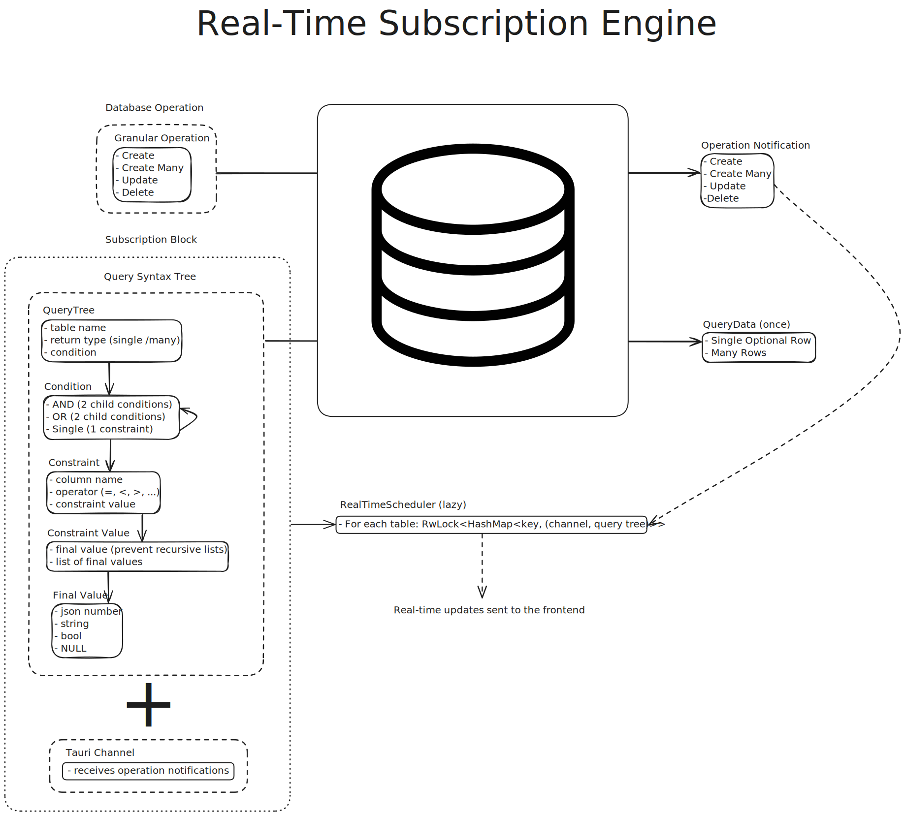

# Real-Time SQLx

Rust backend for the real-time query engine.

Run tests against Sqlite:

```bash
cargo test
```

## Behind the API

<div align="center">
  
</div>

### Query Syntax Tree

Queries are represented by a _syntax tree_ that encodes a subset of SQL. They have two functions:

- Being converted into SQL queries for fetching data once (or initially when creating a subscription).
- Checking if an `OperationNotification` that just occured affects the current query subscription.

### Channels

Tauri channels enable the backend to send data to the frontend. In `real-time-sqlx`, channels are used to send `OperationNotifications` so that the frontend updates its store accordingly.

When a subscription is created, the frontend sends 3 elements to the backend:

- A `QueryTree`
- A channel instance
- A subscription `uuid` key (for targeted removal triggered by the frontend)

The `(QueryTree, Channel)` tuples are stored on a **per-table** basis, meaning that `OperationNotifications` are only checked against the current active subscriptions of their respective table. This is easy to implement and generalize to as many tables as required, but not recommended for high usage cases (in multi-user cases, you should separate subscription families further in order to avoid checking all table operations against all active subscriptions of the same table).

### Granular Operations

Similarly to queries, database operations like `INSERT`, `DELETE` and `UPDATE` are represented by the `GranularOperation` enum. When executed, they are converted into an `Option<OperationNotification>`, which is `None` if the operation failed (represented by `null` in the frontend).

Every time a `GranularOperation` succeeds, its resulting `OperationNotification` is used to see which subscriptions of the related table are affected by it. If an `OperationNotification` matches a query, it is send to the frontend via its corresponding channel.
Exception: if an `OperationNotification::Update` does not match a query, an `OperationNotification::Delete` is sent to the channel. This causes the channel to remove the element of corresponding ID from its cache, in case a previously matching element was altered in a way that makes it not match the query anymore.

### Real Time Dispatcher

The heart of the engine is the `RealTimeDispatcher` struct. It holds, for each declared `(table name, table struct)` pair, an instance of `HashMap<key, (QueryTree, Channel)>` locked in a thread-safe and async-safe way behind a `RwLock`.

It is responsible for adding and removing supscriptions, and it processes `GranularOperations` before checking their related queries. One singleton instance is owned and managed by Tauri and passed as an argument to the Tauri commands.
